# Traffic for ATAK — User Guide

**Version 0.8 · takwerx**

**Download Traffic 0.8** (pick the one matching your ATAK-CIV version, sideload, then load it in ATAK's Plugins manager):

- **ATAK-CIV 5.6:** https://github.com/takwerx/traffic/releases/download/v0.8/ATAK-Plugin-Traffic-0.8--5.6.0-civ-release.apk
- **ATAK-CIV 5.7:** https://github.com/takwerx/traffic/releases/download/v0.8/ATAK-Plugin-Traffic-0.8--5.7.0-civ-release.apk
- **ATAK-CIV 5.8:** https://github.com/takwerx/traffic/releases/download/v0.8/ATAK-Plugin-Traffic-0.8--5.8.0-civ-release.apk

All releases: https://github.com/takwerx/traffic/releases

Traffic puts two things on the map you are already using: **live traffic**, the
colored road lines, kept current while the map sits still; and **road
incidents** from every US state — crashes, closures, lane closures, road work,
hazards and message signs — drawn as icons.

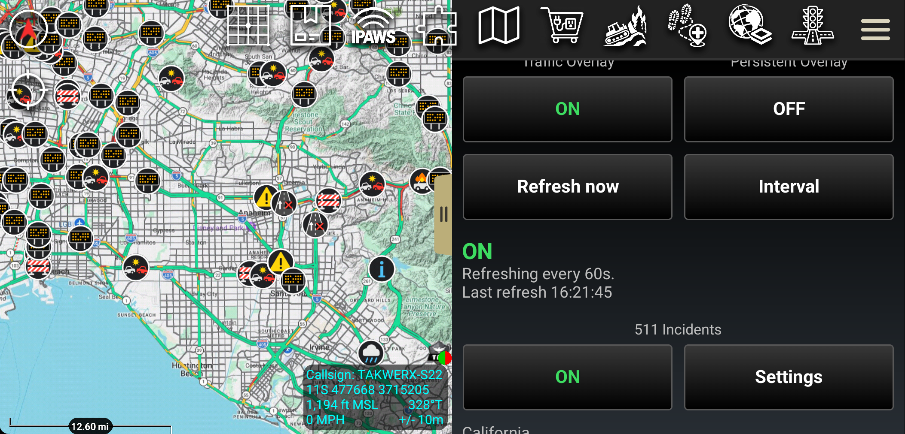

---

## 1. What this is for, in one minute

**Traffic that stays live.** ATAK can show an online map source and ask it to
refresh on a timer, but it only refreshes while the map is being drawn. A
device on a dash mount or a desk is not drawing anything, so the traffic on
screen is however old the last redraw left it — and the moment you touch the
map to check, it updates, which is what makes the problem so easy to miss.
This plugin drives the refresh itself, so the map stays current whether or not
anyone is touching it.

**What is happening on the road.** Every state runs a traveler information
system (its 511) with the crashes, closures and work zones its highway patrol
and transportation department know about. Each one publishes it differently. A
takwerx server reads all fifty and hands the plugin one simple feed, so the
icons look and behave the same in every state.

> **Traffic is live data.** There is no useful offline mode. Cached traffic is,
> by definition, old traffic — which is worse than none, because it looks
> current.

---

## 2. Before you start

- **Match the plugin to your ATAK version.** Builds are tied to the ATAK
  release they were built for; **5.6, 5.7 and 5.8 builds are published.** A
  mismatched build will not load.
- **Install and load the plugin** through ATAK's *Plugins* manager (TAK Package
  Mgmt), the same as any other plugin.
- **Pick your base map first.** Traffic draws on top of whatever you have
  selected — imagery, topo or street — and you can change it afterwards.
- **You need a network connection.** The plugin talks outbound over HTTPS only:
  to the traffic tile provider, and to the takwerx incident server. Never to
  your TAK server, and it generates no CoT.
- **Coverage.** Traffic is good on highways and major roads and thin on forest
  roads. Incidents are whatever each state publishes; some publish far more
  than others (Rhode Island, for one, publishes only its planned closures for
  the week).

---

## 3. Step by step

### Step 1 — Open the plugin

Tap the Traffic icon in the ATAK toolbar.

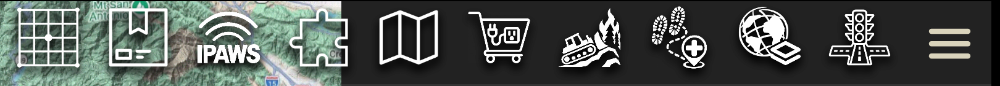

### Step 2 — The main screen

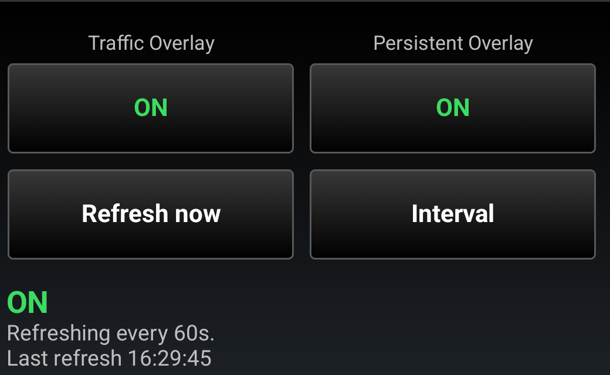 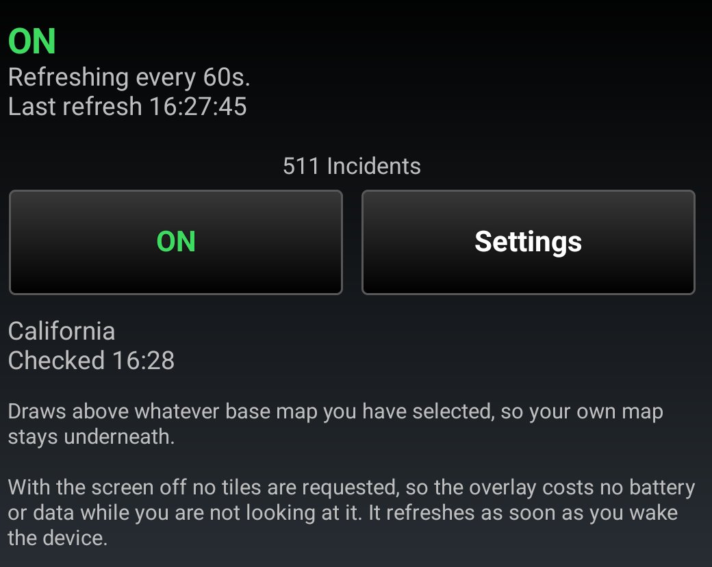

- **Traffic Overlay** turns the traffic colors on and off.
- **Persistent Overlay** decides whether they come back by themselves when ATAK
  restarts. It is off by default: restoring means fetching the moment ATAK
  launches, which is not a choice to make for you on a metered connection.
- **Refresh now** fetches at once. **Interval** sets how often it refreshes on
  its own.
- **511 Incidents** turns the incident icons on and off; they remember on or off
  by themselves. **Settings** opens their page.

Each switch reads **ON** in green or **OFF** in red. The line under each part
says what it is doing: when traffic tiles last arrived, and which states'
incidents were last checked and when.

### Step 3 — How often traffic refreshes

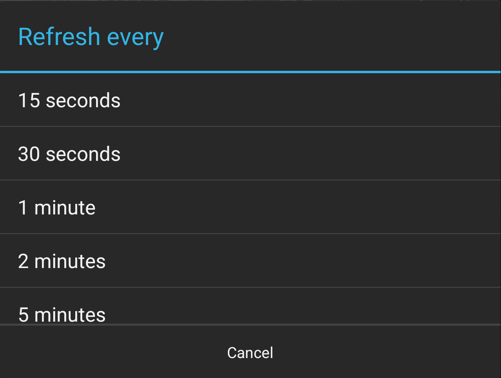

Pick 15 seconds to 10 minutes. Shorter is fresher and costs more data; zoomed
out over a city at 15 seconds is the expensive case.

### Step 4 — Your map stays underneath, and the highway numbers stay readable

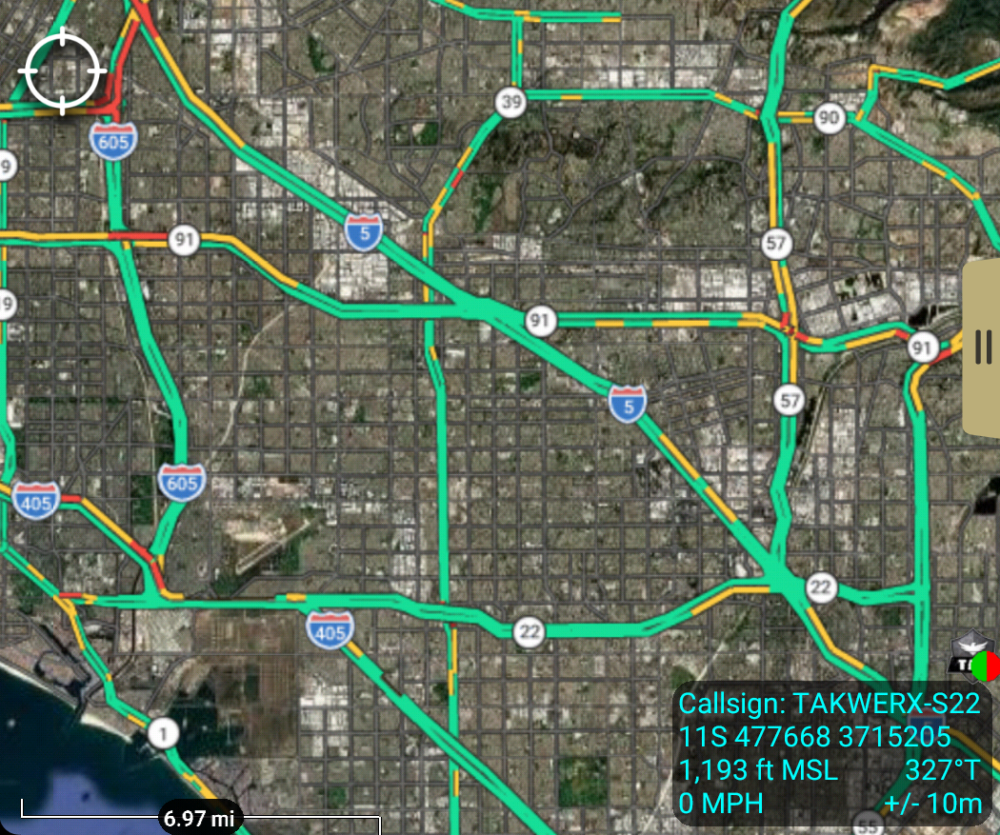

Traffic is drawn above your base map and never replaces it. **Highway shields
are drawn on top of the traffic**, so the route number is not hidden under a red
line. On a base map that has its own shields you may see a road's number twice;
that is the two layers agreeing, not a fault.

### Step 5 — Road incidents: pick your states

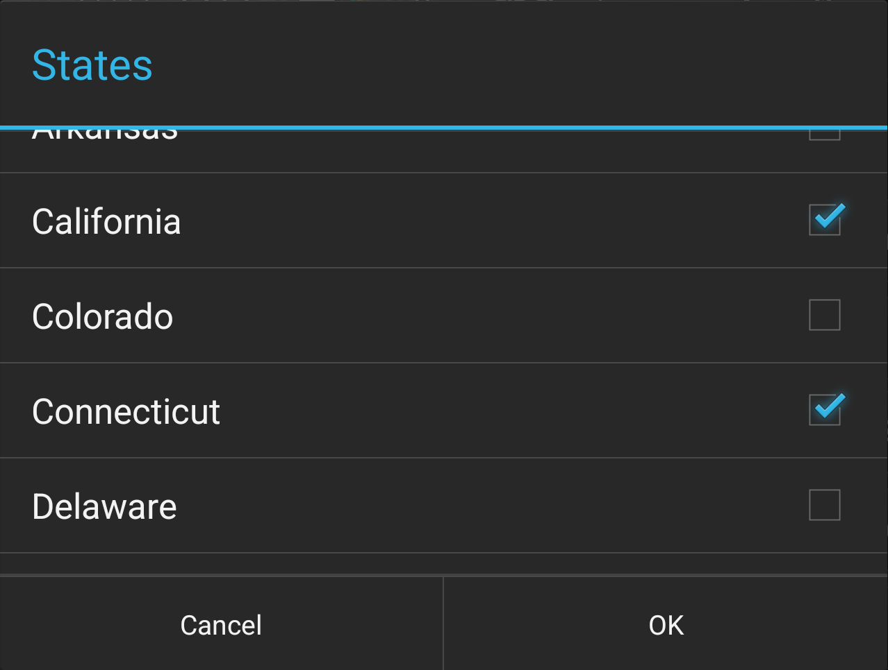

Turn **511 Incidents** on. The first time, the state you are in is picked for
you. Add every state you work in or drive through under **Settings → States**.
Nothing is downloaded for a state until the map is over it (unless Area is set
to Everything).

When the map is over a state you have not picked, the pane says so and offers
it in one tap:

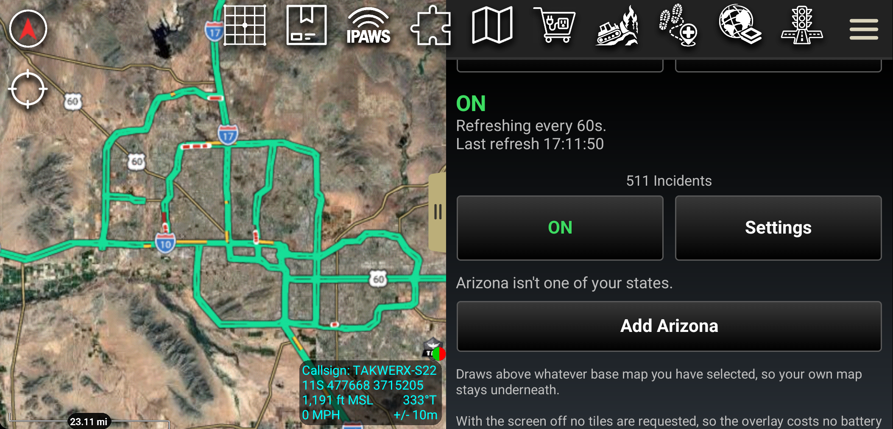

### Step 6 — The incident types

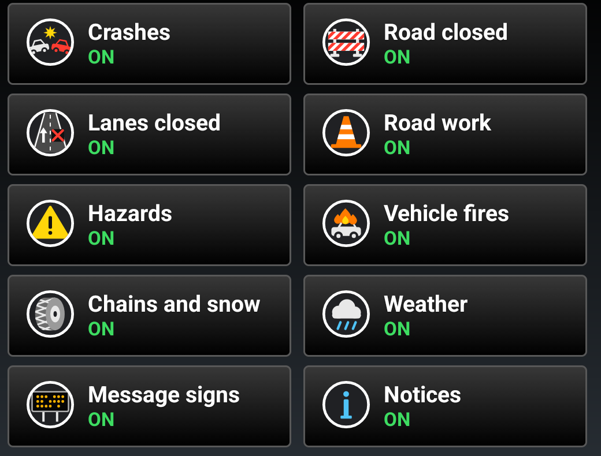

| Icon | Type | What it means |
|---|---|---|
| Two cars | **Crashes** | A collision. After six hours it is shown as what it left behind (see *Good to know*). |
| Barricade | **Road closed** | The road or a ramp is closed. |
| Lane with an X | **Lanes closed** | The road is open with lanes closed. |
| Cone | **Road work** | Work zones and construction. |
| ! | **Hazards** | Debris, stalled vehicles, road damage, rock fall. |
| Car on fire | **Vehicle fires** | |
| Tire | **Chains and snow** | Chain control and winter conditions. |
| Cloud | **Weather** | Flooding, fog, wind, smoke. |
| Sign board | **Message signs** | What a highway message sign says right now. |
| i | **Notices** | Anything else the agency posted. |

Tap a tile to switch that type off or on. Icons only, never road lines: the
traffic colors already show the roads.

### Step 7 — The incident Settings page

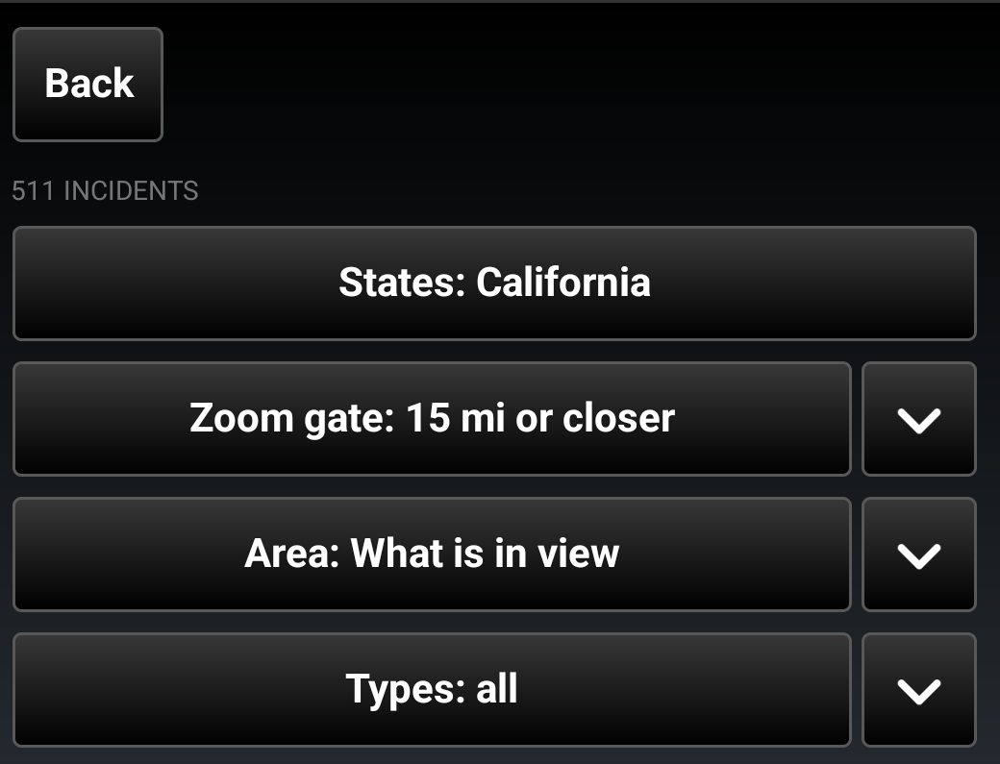

Each row says what it is set to; the arrow beside it opens it. **Back** returns
to the main screen.

**Zoom gate** — how far in you must zoom before icons are drawn. **Use this
zoom** sets it to what the scale bar reads now; the button beside it picks from
a list, including **Always**.

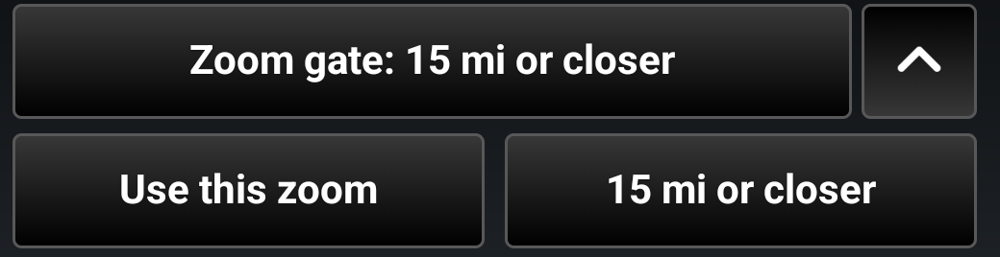

Zoomed out past the gate, no icons are drawn and the pane says why:

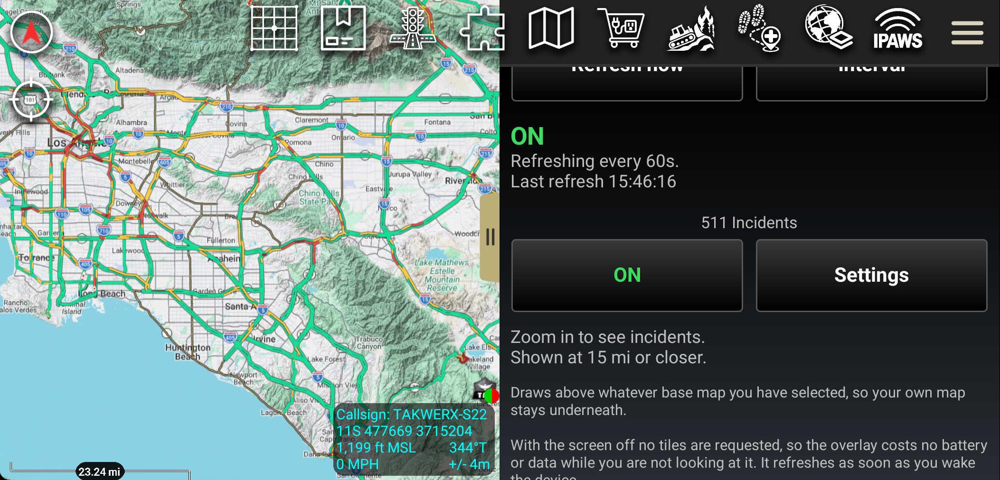

**Area** — *What is in view* (the default) shows what is on screen. Slide right
for a distance around **My Location** or the **map center**. **Use this extent**
sets the distance to what is on screen now; **Presets** has common distances,
What is in view and **Everything**. With a distance set, the main screen says
so, so a hidden part of the map is never a surprise.

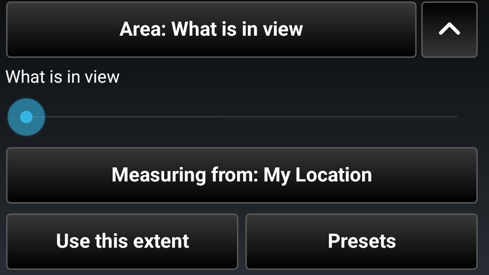

### Step 8 — Tap an incident

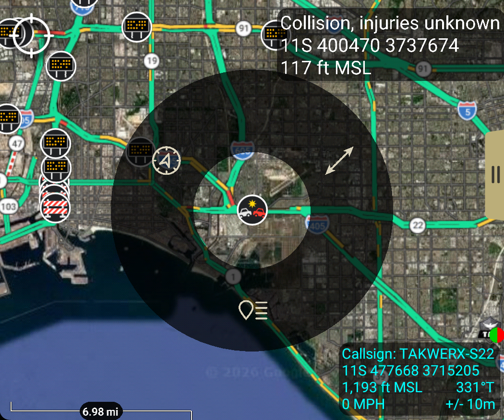

Tap an icon: its title shows above it with the menu around it. The list item at
the bottom opens the details. Where icons sit on top of each other, ATAK first
asks which one you meant.

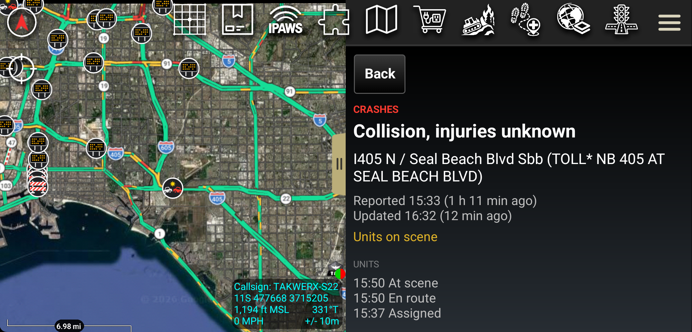

The details give the type, a short title, where, and when it was reported and
last updated. For California Highway Patrol incidents they list the units:
assigned, en route, at scene. The page keeps updating while it is open, and an
incident that clears is marked so rather than vanishing under you.

A **message sign** is drawn as it reads on the road; a **closure** says what is
closed, why, and when it is expected to open:

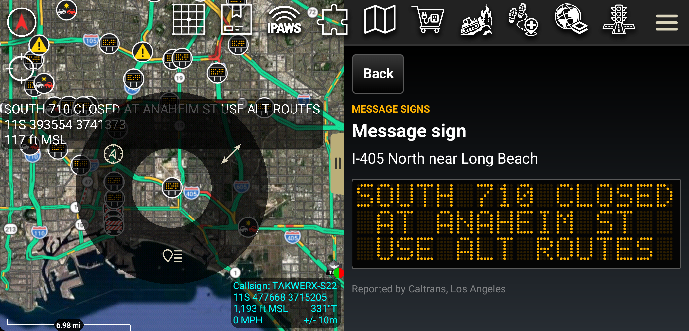

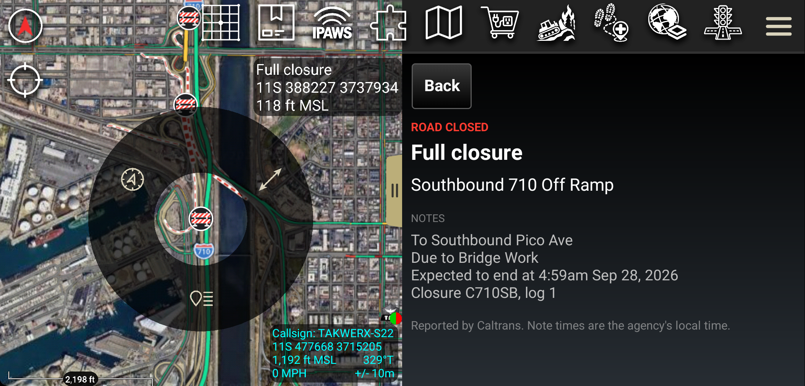

---

## 4. Leave it alone — that is the point

Put the device down and do not touch it. The traffic keeps refreshing on its
own and **Last refresh** keeps advancing; the incidents are checked every 15
seconds.

**Watch the timestamp, not the colors.** Traffic that has not changed looks the
same refresh after refresh — at three in the morning it will be green for hours
— so the timestamp is how you know it is live. "Last refresh" means tiles
arrived, not that the picture changed; if the network drops, that time stops
moving and a warning appears beneath it.

### Screen off, and why nothing is wrong

With the screen off nothing is fetched at all — no traffic, no incidents — so it
costs no battery and no data while nobody is looking. When you wake the device
both refresh within a few seconds, and the status says **Refreshed on wake at
...** for a couple of minutes, so you know what you see arrived after you picked
the device up.

### Turning it off

Set **Traffic Overlay** or **511 Incidents** to **OFF**. That layer is removed and
stops fetching; your base map is untouched.

---

## 5. Good to know

- **A crash more than six hours old** is shown as what it left behind — lanes
  closed, road closed or a hazard — and its details say when it was reported.
  States often leave a crash open for days while the lanes behind it stay
  closed.
- **Times in the notes** are the agency's own local time.
- **Zoom matters for traffic.** It is drawn from about zoom 10 down to street
  level; zoomed far out you will see major highways only.
- **After updating the plugin** ATAK unloads it; load it again from the Plugins
  manager.

---

## 6. The manual on the device

The same guide is inside the plugin as a PDF: ATAK **Settings → Tool
Preferences → Traffic → Plugin Documentation**.

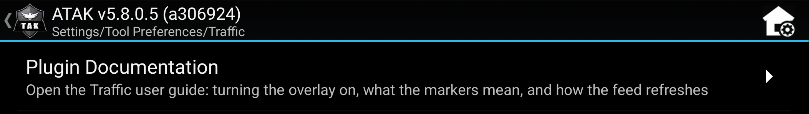

---

## 7. Contact

Andreas Johansson, takwerx
https://github.com/takwerx/traffic/issues
